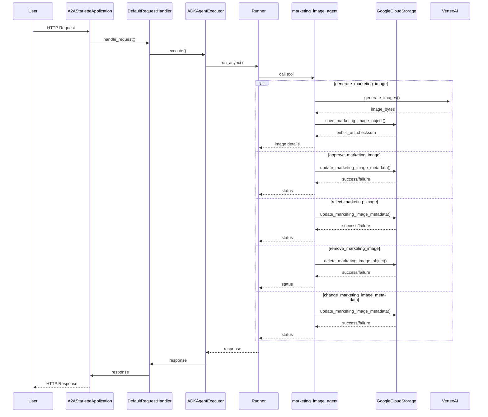
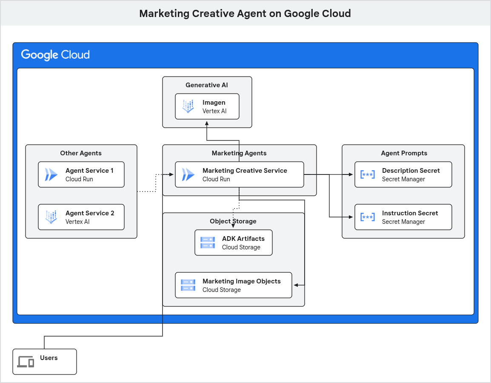

# Marketing Creative Agent

This is an example implementation of an AI agent for the marketing domain of a supermarket retailer.  The agent is designed to generate marketing images based on text prompts, leveraging Google's Generative AI models and the Google Agent Development Kit (ADK).

The agent's capabilities are exposed via an A2A (Agent-to-Agent Protocol) compliant web server.

## Table of Contents

- [Features](#features)
- [Architecture](#architecture)
- [Getting Started](#getting-started)
  - [Prerequisites](#prerequisites)
  - [Configuration](#configuration)
  - [Installation](#installation)
  - [Running the Application](#running-the-application)
- [Running with Docker](#running-with-docker)
- [Project Structure](#project-structure)

## Features

- **Image Generation and Business Lifecyle Management**: The agent has a capability to generate marketing images from text descriptions - e.g. "A shopping cart full of fresh vegetables".  The agent also has skills related to approvals (i.e. for use by the business), lifecycle management (e.g. remove),and metadata management (e.g. update an images description).
- **A2A Compliant**: Implements the A2A (Agent-to-Agent) protocol for standardised agent communication.
- **Tool-Using Agent**: Utilises the Google ADK to create an agent that uses a custom tools for image generation, approval marking, and lifecycle management.
- **Cloud Integrated**: Stores generated images in a Google Cloud Storage bucket.
- **Containerised**: Includes a `Dockerfile` and a `Procfile` for easy deployment and scaling.

## Architecture

- **Core Logic (`marketing_image_agent`)**: Contains the agent definition using Google ADK.  For image generation, the agent is instructed to use a tool (`generate_image_tool`) which calls the `imagen` model on Vertex AI to generate an image and then stores it in Google Cloud Storage.
- **Agent Executor (`agent_executor.py`)**: Acts as a bridge between the A2A server and the Google ADK agent.  The `ADKAgentExecutor` handles incoming requests, invokes the ADK runner, and manages the task lifecycle.
- **Web Framework (`__main__.py`)**: Sets-up and runs a Starlette web application using the `a2a-sdk`.  It defines the agent's public-facing `AgentCard` (its capabilities, skills, and endpoints) and routes incoming HTTP requests to the `ADKAgentExecutor`.

## Service Sequence 



## Getting Started

### Prerequisites

- Python 3.12+
- uv ([installation instructions](https://docs.astral.sh/uv/getting-started/installation/))
- Google Cloud Platform Project: At least one Google Cloud project is required to house all the necessary cloud resources.
- Google Cloud Vertex AI: You'll need to have the Vertex AI API enabled in your Google Cloud project to access the generative AI models.
- Google Cloud Storage Buckets:
    - A bucket for storing ADK (Agent Development Kit) artifacts (optional).
    - A bucket for storing the generated marketing image objects (binary image data).
- If deploying to Cloud Run using the cloudbuild.yaml.example file as a template, you will need:
    - Two Secret Manager secrets:
        - Agent description.
        - Agent instructions.
    - An Artifact Registry docker repository.
- Authentication:
    - You'll need an authenticated gcloud CLI or a service account with appropriate permissions.  This is 'playing it safe' with respect to all the things you may want to do as part of working with this project (including if a Service Account is assigned to your Cloud Run resource):
        - AI Platform Developer
        - Cloud Datastore User
        - Cloud Run Invoker
        - Cloud Trace Admin
        - Eventarc Developer
        - Eventarc Event Receiver
        - Logs Bucket Writer
        - Pub/Sub Publisher
        - Pub/Sub Subscriber
        - Secret Manager Secret Accessor
        - Storage Admin
        - Storage Object User
        - Vertex AI User
    - The service account used for Cloud Build to build and deploy to Cloud Run will need:
        - Cloud Run Admin
        - Secret Manager Secret Accessor
        - Storage Admin
        - Artifact Registry Writer
        - Logs Configuration Writer

### Configuration

The application is configured using environment variables.  Create an `.env` file (see `.env.example`) and populate it.

It's very important that you set the following environmental variables before running, either using an `.env` file or using the following commands:

```bash
GOOGLE_CLOUD_PROJECT=<your-project-id>
GOOGLE_CLOUD_LOCATION=europe-west4 # Or another supported region with respect to AI model support, etc.
GOOGLE_GENAI_USE_VERTEXAI=TRUE
```

### Installation

1.  **Navigate to this agent's directory**

2.  **Create and use a virtual environment:**

    ```bash
    uv venv
    source .venv/bin/activate
    ```

2.  **Install the dependencies using `uv`:**

    ```bash
    uv pip install -r requirements.txt
    ```


### Running the Application Locally

1.  **Authenticate with gcloud, set a quota project, and set a project:**

    ```bash
    gcloud auth login (if not already logged in)
    gcloud auth application-default login
    export GOOGLE_CLOUD_PROJECT=<your-project-id>
    gcloud config set project $GOOGLE_CLOUD_PROJECT
    gcloud auth application-default set-quota-project $GOOGLE_CLOUD_PROJECT
    ```

2.  **Start the server from the root directory:**

    ```bash
    uv run python __main__.py
    ```

The server will be running at `http://0.0.0.0:8080` (or a host:port combo you have set using environment variables).

3.  **Use adk web or A2A Inspector to test the agent:**
TBC [A2AInspector](https://github.com/a2aproject/a2a-inspector).

## Running with Docker

You can also build and run the application using Docker.

1.  **Build the image:**

    ```bash
    docker build -t marketing-creative-agent .
    ```

2.  **Ensure you have authenticated with gcloud to generate the necessary credentials file:**

    ```bash
    gcloud auth application-default login
    ```

3.  **Run the container:**

    ```bash
    docker run --rm -p 8080:8080 \
    -v "$HOME/.config/gcloud/application_default_credentials.json:/app/gcp-credentials.json:ro" \
    --env GOOGLE_APPLICATION_CREDENTIALS="/app/gcp-credentials.json" \
    --env-file .env \
    marketing-creative-agent
    ```

The command above reads the content of your gcloud credentials file and passes it directly to the `GOOGLE_APPLICATION_CREDENTIALS` environment variable inside the container.  It also passes your `.env` file for application configuration.

### Google Cloud Deployment

If you deploy the Agent Service to Google Cloud Run, a number of resources will be being used.  Here's a diagram to show resource use.



## Project Structure

```
├── marketing_image_agent/  # Core agent logic
│   ├── agent.py            # Defines the ADK agent, tools, and GCS client
│   └── __init__.py
├── __main__.py             # Application entrypoint, sets up the A2A Starlette app
├── agent_executor.py       # Bridge between the A2A server and the ADK agent
├── Dockerfile              # For containerizing the application
├── pyproject.toml          # Project metadata and dependencies
├── requirements.txt        # Pinned dependencies for production
└── .env.example            # Example environment variables
```