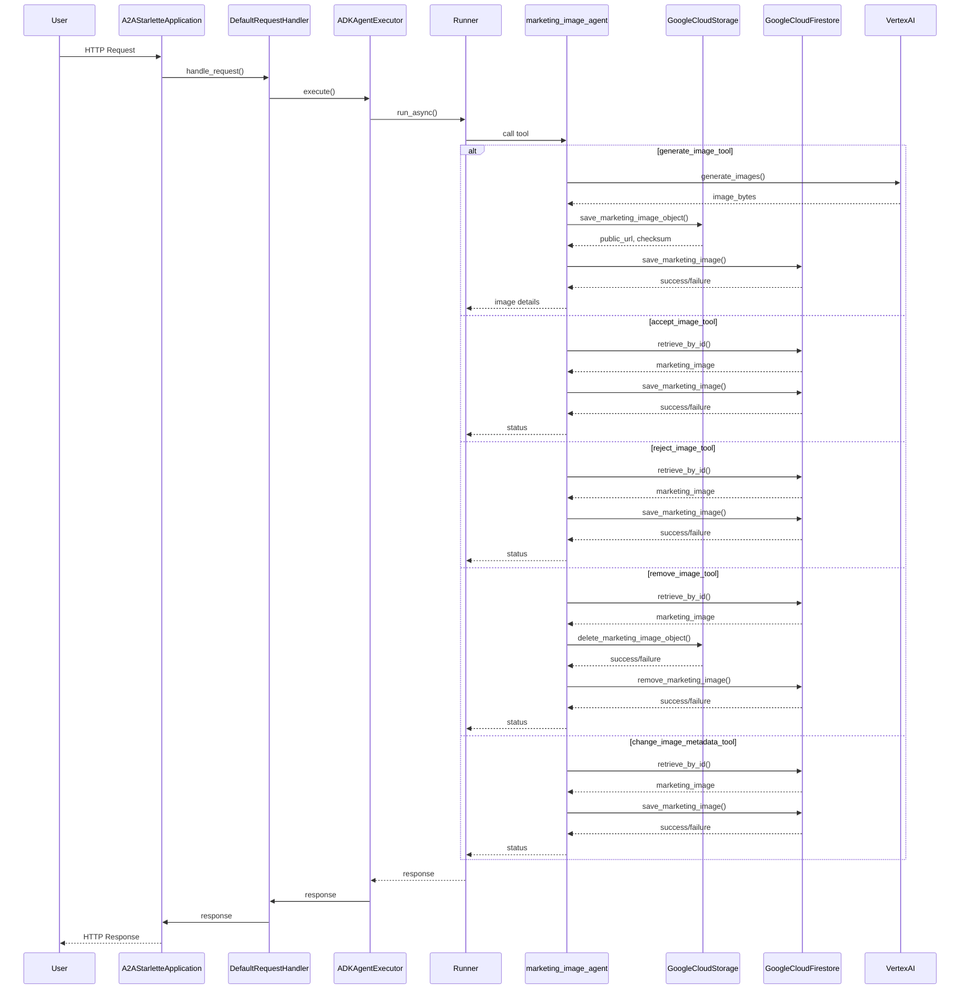
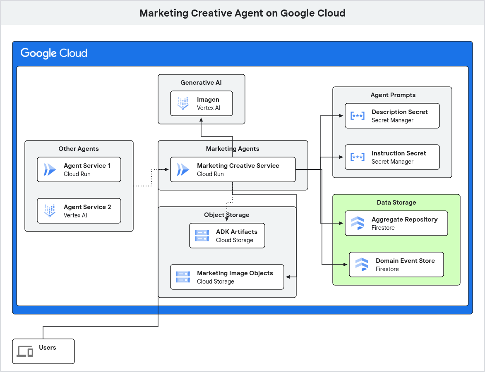

# Marketing Creative Agent

This is an example implementation of an AI agent for the marketing domain of a supermarket retailer.  The agent is designed to generate marketing images based on text prompts, leveraging Google's Generative AI models and the Google Agent Development Kit (ADK).  

This agent introduces the foundational Domain Model of our system, a crucial first step in building a robust and maintainable AI agent.  You'll find the core business logic, entities, and value objects in the marketing_image_agent/domain directory.  This is the heart of our agent, representing the business rules and concepts in a way that is independent of any specific technology.

The project follows principles of Domain-Driven Design (DDD) by modeling the core business concept of a `MarketingImage` as an aggregate, which is persisted along with its domain events.
The agent's capabilities are exposed via an A2A (Agent-to-Agent Protocol) compliant web server.

## Table of Contents

- [Features](#features)
- [What's Been Introduced?](#whats-been-introduced)
- [Architecture](#architecture)
- [Getting Started](#getting-started)
  - [Prerequisites](#prerequisites)
  - [Configuration](#configuration)
  - [Installation](#installation)
  - [Running the Application](#running-the-application)
- [Running with Docker](#running-with-docker)
- [Project Structure](#project-structure)
- [What's Next?](#whats-next)

-----

## Features

- **Image Generation and Business Lifecyle Management**: The agent has a capability to generate marketing images from text descriptions - e.g. "A shopping cart full of fresh vegetables".  The agent also has skills related to approvals (i.e. for use by the business), lifecycle management (e.g. remove),and metadata management (e.g. update an images description).
- **A2A Compliant**: Implements the A2A (Agent-to-Agent) protocol for standardised agent communication.
- **Tool-Using Agent**: Utilises the Google ADK to create an agent that uses a custom tools for image generation, approval marking, and lifecycle management.
- **Domain-Driven Design**: Models the `MarketingImage` as a domain aggregate, capturing its state and lifecycle.
- **Cloud Integrated**: Stores generated images in a Google Cloud Storage bucket and persists the `MarketingImage` aggregate state and domain events in Google Cloud Firestore.
- **Containerised**: Includes a `Dockerfile` and a `Procfile` for easy deployment and scaling.

## What's Been Introduced?

* **Domain-Driven Design (DDD) Principles:** We've started to apply DDD principles by defining a clear domain layer.  This is where we model the "ubiquitous language" of our business domain, ensuring that the code is a direct reflection of the business processes.
* **Entities and Value Objects:** You'll see the first implementation of Entities (like MarketingImageAggregate) and Value Objects (like ImageDescription, Status, etc.).  This is a key part of creating a rich, expressive domain model.
* **Domain Events:** We've introduced Domain Events to capture significant occurrences within our domain.  This is a foundational piece for building a reactive and event-driven system.


## Architecture

- **Domain Layer (`marketing_image_agent/domain`)**: The core of the application, containing the business logic. It defines the `MarketingImage` aggregate, its factory, and domain events.  This layer is independent of external concerns like databases or frameworks.
- **Agent & Tools (`marketing_image_agent/agent.py`)**: Contains the agent definition using Google ADK.  The agent is instructed to use a tool (`generate_image_tool`) which orchestrates the image generation process:
  1.  Calls the `imagen` model on Vertex AI to generate an image.
  2.  Stores the image file in Google Cloud Storage.
  3.  Creates a `MarketingImage` aggregate instance with the image metadata.
  4.  Persists the aggregate and its domain events to Google Cloud Firestore using a repository pattern.
- **Agent Executor (`agent_executor.py`)**: Acts as a bridge between the A2A server and the Google ADK agent.  The `ADKAgentExecutor` handles incoming requests, invokes the ADK runner, and manages the task lifecycle.
- **Web Framework (`__main__.py`)**: Sets-up and runs a Starlette web application using the `a2a-sdk`.  It defines the agent's public-facing `AgentCard` (its capabilities, skills, and endpoints) and routes incoming HTTP requests to the `ADKAgentExecutor`.

## Service Sequence



## Getting Started

### Prerequisites

- Python 3.12+
- uv (recommended for dependency management)
- Google Cloud Platform Project: At least one Google Cloud project is required to house all the necessary cloud resources.
- Google Cloud Vertex AI: You'll need to have the Vertex AI API enabled in your Google Cloud project to access the generative AI models.
- Google Cloud Storage Buckets:
    - A bucket for storing ADK (Agent Development Kit) artifacts (optional).
    - A bucket for storing the generated marketing image objects (binary image data).
- Google Cloud Firestore: One or more Firestore databases are required for:
    - Marketing image aggregate repository.
    - Domain event store (batch written in this example).
- If deploying to Cloud Run using the cloudbuild.yaml.example file as a template, you will need:
    - Two Secret Manager secrets:
        - Agent description.
        - Agent instructions.
    - An Artifact Registry docker repository.
- Authentication:
    - You'll need an authenticated gcloud CLI or a service account with appropriate permissions.  This is 'playing it safe' with respect to all the things you may want to do as part of working with this project (including if a Service Account is assigned to your Cloud Run resource):
        - AI Platform Developer
        - Cloud Datastore User
        - Cloud Run Invoker
        - Cloud Trace Admin
        - Eventarc Developer
        - Eventarc Event Receiver
        - Logs Bucket Writer
        - Pub/Sub Publisher
        - Pub/Sub Subscriber
        - Secret Manager Secret Accessor
        - Storage Admin
        - Storage Object User
        - Vertex AI User
    - The service account used for Cloud Build to build and deploy to Cloud Run will need:
        - Cloud Run Admin
        - Secret Manager Secret Accessor
        - Storage Admin
        - Artifact Registry Writer
        - Logs Configuration Writer

### Configuration

The application is configured using environment variables.  Create a `.env` file (see `.env.example`) and populate it.

### Configuration

The application is configured using environment variables.  Create a `.env` file (see `.env.example`) and populate it .

### Installation

1.  **Navigate to this agent's directory**

2.  **Create and use a virtual environment:**

    ```bash
    uv venv
    source .venv/bin/activate
    ```

2.  **Install the dependencies using `uv`:**

    ```bash
    uv pip install -r requirements.txt
    ```


### Running the Application Locally

1.  **Authenticate with gcloud:**

    ```bash
    gcloud auth application-default login
    ```

2.  **Start the server from the root directory:**

    ```bash
    uv run python __main__.py
    ```

The server will be running at `http://0.0.0.0:8080` and can be tested with [A2AInspector](https://github.com/a2aproject/a2a-inspector).

## Running with Docker

You can also build and run the application using Docker.

1.  **Build the image:**

    ```bash
    docker build -t marketing-creative-agent .
    ```

2.  **Ensure you have authenticated with gcloud to generate the necessary credentials file:**

    ```bash
    gcloud auth application-default login
    ```

3.  **Run the container:**

    ```bash
    docker run --rm -p 8080:8080 \
    -v "$HOME/.config/gcloud/application_default_credentials.json:/app/gcp-credentials.json:ro" \
    --env GOOGLE_APPLICATION_CREDENTIALS="/app/gcp-credentials.json" \
    --env-file .env \
    marketing-creative-agent
    ```

The command above reads the content of your gcloud credentials file and passes it directly to the `GOOGLE_APPLICATION_CREDENTIALS` environment variable inside the container.  It also passes your `.env` file for application configuration.

### Google Cloud Deployment

If you deploy the Agent Service to Google Cloud Run, a number of resources will be being used.  Here's a diagram to show resource use (new resources/components/options vs. step [0](/0/) in highlighted in green):


## Project Structure

```plaintext
├── marketing_image_agent/
│   ├── domain/                 # Core business logic (DDD), independent of external concerns
│   │   ├── entities/           # Contains the domain aggregates, like MarketingImage
│   │   ├── events/             # Contains the domain event definitions
│   │   ├── factories/          # Responsible for creating complex domain objects
│   │       ├── marketing_image_aggregate_factory.py
│   │       └── marketing_image_domain_events_factory.py
│   │   ├── services/           # Contains domain services with logic that doesn't fit in an aggregate
│   │   └── value_objects/      # Contains the value objects that model descriptive aspects of the domain
│   ├── shared/
│   │   └── utils.py
│   ├── agent.py                # Defines ADK agent, tools, GCS client, and Firestore repository
│   └── __init__.py
├── __main__.py                 # Application entrypoint, sets up the A2A Starlette app
├── agent_executor.py           # Bridge between the A2A server and the ADK agent
├── config.py                   # Application configuration management
├── Dockerfile                  # For containerising the application
├── requirements.txt            # Pinned dependencies
└── .env.example                # Example environment variables
```

## What's Next?

**The Next Step: Full Hexagonal Architecture (Agent in Directory "2")**
While this agent establishes the core domain, it's important to understand that it is not yet a complete implementation of a production-ready, deterministic system.  The agent in directory "2" takes the next logical step by implementing a full Hexagonal Architecture (also known as Ports and Adapters).

Here's a preview of what's introduced in the next iteration of the agent to give you a roadmap of where we are going:
* **Application Layer:** This layer will orchestrate the domain logic.  It will contain the application services, commands, and ports (interfaces) that define how the outside world interacts with our application.

* **Infrastructure Layer:** This is where the "adapters" to external systems will live.  For example, you'll find concrete implementations for interacting with databases, messaging systems, and the generative AI models. This is how we decouple our core application from specific technologies.

* **Ports and Adapters:** The agent in directory "2" will formalise the concept of "ports" (the interfaces in the application layer) and "adapters" (the concrete implementations in the infrastructure layer).  This is the key to achieving a loosely-coupled system, which is essential for testability, maintainability, and evolving our technology stack without impacting the core business logic.

By understanding the evolution from this agent to the next, you'll gain a deeper appreciation for why we are building a system that is not 100% probabilistic.  The domain model you see here is the first step towards building a system that has deterministic, auditable, and reliable components, which are essential for any real-world business application.