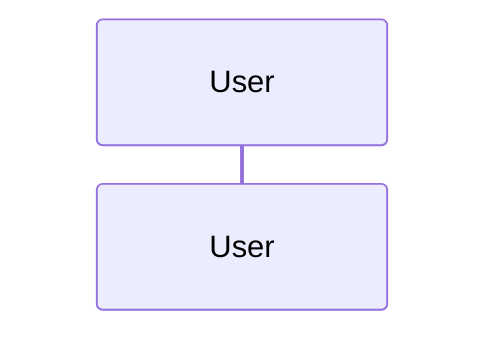

# Marketing Creative Agent

This is an example implementation of an AI agent for the marketing domain of a supermarket retailer.  The agent is designed to generate marketing images based on text prompts, leveraging Google's Generative AI models and the Google Agent Development Kit (ADK).  This AI agent has a Domain layer that captures business logic and state.

The project follows principles of Domain-Driven Design (DDD) by modeling the core business concept of a `MarketingImage` as an aggregate, which is persisted along with its domain events.
The agent's capabilities are exposed via an A2A (Agent-to-Agent Protocol) compliant web server.

## Table of Contents

- [Features](#features)
- [Architecture](#architecture)
- [Getting Started](#getting-started)
  - [Prerequisites](#prerequisites)
  - [Configuration](#configuration)
  - [Installation](#installation)
  - [Running the Application](#running-the-application)
- [Running with Docker](#running-with-docker)
- [Project Structure](#project-structure)

## Features

- **Image Generation**: Generates marketing images from text descriptions - e.g. "A shopping cart full of fresh vegetables".
- **A2A Compliant**: Implements the A2A (Agent-to-Agent) protocol for standardised agent communication.
- **Tool-Using Agent**: Utilises the Google ADK to create an agent that uses a custom tool for image generation.
- **Domain-Driven Design**: Models the `MarketingImage` as a domain aggregate, capturing its state and lifecycle.
- **Cloud Integrated**: Stores generated images in a Google Cloud Storage bucket and persists the `MarketingImage` aggregate state and domain events in Google Cloud Firestore.
- **Containerised**: Includes a `Dockerfile` for easy deployment and scaling.

## Architecture

- **Domain Layer (`marketing_image_agent/domain`)**: The core of the application, containing the business logic. It defines the `MarketingImage` aggregate, its factory, and domain events.  This layer is independent of external concerns like databases or frameworks.
- **Agent & Tools (`marketing_image_agent/agent.py`)**: Contains the agent definition using Google ADK.  The agent is instructed to use a tool (`generate_image_tool`) which orchestrates the image generation process:
  1.  Calls the `imagen` model on Vertex AI to generate an image.
  2.  Stores the image file in Google Cloud Storage.
  3.  Creates a `MarketingImage` aggregate instance with the image metadata.
  4.  Persists the aggregate and its domain events to Google Cloud Firestore using a repository pattern.
- **Agent Executor (`agent_executor.py`)**: Acts as a bridge between the A2A server and the Google ADK agent.  The `ADKAgentExecutor` handles incoming requests, invokes the ADK runner, and manages the task lifecycle.
- **Web Framework (`__main__.py`)**: Sets-up and runs a Starlette web application using the `a2a-sdk`.  It defines the agent's public-facing `AgentCard` (its capabilities, skills, and endpoints) and routes incoming HTTP requests to the `ADKAgentExecutor`.

## Service Sequence



## Getting Started

### Prerequisites

- Python 3.12+
- uv (recommended for dependency management)
- Access to a Google Cloud Platform project.
- A Google Cloud Storage bucket.
- A Google Cloud Firestore database.
- Authenticated gcloud CLI or a service account with permissions for Vertex AI and Cloud Storage.

### Configuration

The application is configured using environment variables.  Create a `.env` file (see `.env.example`) and populate it.

### Configuration

The application is configured using environment variables.  Create a `.env` file (see `.env.example`) and populate it .

### Installation

1.  **Navigate to this agent's directory**

2.  **Create and use a virtual environment:**

    ```bash
    uv venv
    source .venv/bin/activate
    ```

2.  **Install the dependencies using `uv`:**

    ```bash
    uv pip install -r requirements.txt
    ```


### Running the Application Locally

1.  **Authenticate with gcloud:**

    ```bash
    gcloud auth application-default login
    gcloud auth application-default login
    ```

2.  **Start the server from the root directory:**

    ```bash
    uv run python __main__.py
    ```

The server will be running at `http://0.0.0.0:8080` and can be tested with [A2AInspector](https://github.com/a2aproject/a2a-inspector).

## Running with Docker

You can also build and run the application using Docker.

1.  **Build the image:**

    ```bash
    docker build -t marketing-creative-agent .
    ```

2.  **Ensure you have authenticated with gcloud to generate the necessary credentials file:**

    ```bash
    gcloud auth application-default login
    ```

3.  **Run the container:**

    ```bash
    docker run --rm -p 8080:8080 \
    -v "$HOME/.config/gcloud/application_default_credentials.json:/app/gcp-credentials.json:ro" \
    --env GOOGLE_APPLICATION_CREDENTIALS="/app/gcp-credentials.json" \
    --env-file .env \
    marketing-creative-agent
    ```

The command above reads the content of your gcloud credentials file and passes it directly to the `GOOGLE_APPLICATION_CREDENTIALS` environment variable inside the container.  It also passes your `.env` file for application configuration.

## Project Structure

```plaintext
├── marketing_image_agent/
│   ├── domain/                 # Core business logic (DDD), independent of external concerns
│   │   ├── entities/           # Contains the domain aggregates, like MarketingImage
│   │   ├── events/             # Contains the domain event definitions
│   │   ├── factories/          # Responsible for creating complex domain objects
│   │       ├── marketing_image_aggregate_factory.py
│   │       └── marketing_image_domain_events_factory.py
│   │   ├── services/           # Contains domain services with logic that doesn't fit in an aggregate
│   │   └── value_objects/      # Contains the value objects that model descriptive aspects of the domain
│   ├── shared/
│   │   └── utils.py
│   ├── agent.py                # Defines ADK agent, tools, GCS client, and Firestore repository
│   └── __init__.py
├── __main__.py                 # Application entrypoint, sets up the A2A Starlette app
├── agent_executor.py           # Bridge between the A2A server and the ADK agent
├── config.py                   # Application configuration management
├── Dockerfile                  # For containerising the application
├── requirements.txt            # Pinned dependencies
└── .env.example                # Example environment variables
```