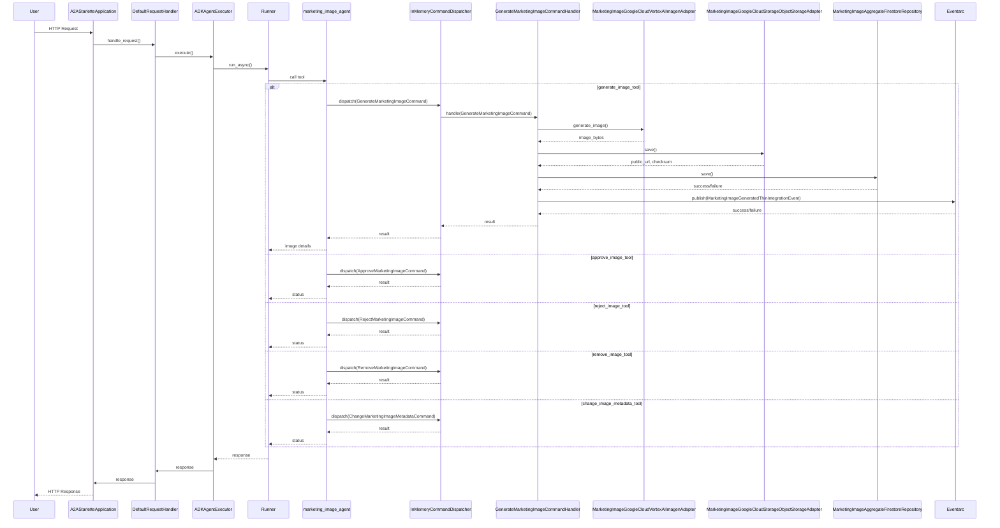
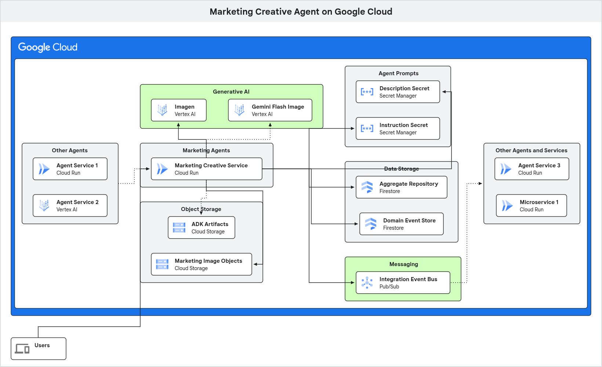

# Marketing Creative Agent

This is an example implementation of an AI agent for the marketing domain of a supermarket retailer.  The agent is designed to generate marketing images based on text prompts, leveraging Google's Generative AI models and the Google Agent Development Kit (ADK).  This AI agent has an Application layer that contains the use cases of our agent and is the entry point for all external interactions.

The agent's capabilities are exposed via an A2A (Agent-to-Agent Protocol) compliant web server.

## Table of Contents

  - [Features](https://www.google.com/search?q=%23features)
  - [What's Been Introduced?](#whats-been-introduced)
  - [Architecture](https://www.google.com/search?q=%23architecture)
  - [Getting Started](https://www.google.com/search?q=%23getting-started)
      - [Prerequisites](https://www.google.com/search?q=%23prerequisites)
      - [Configuration](https://www.google.com/search?q=%23configuration)
      - [Installation](https://www.google.com/search?q=%23installation)
      - [Running the Application](https://www.google.com/search?q=%23running-the-application)
  - [Running with Docker](https://www.google.com/search?q=%23running-with-docker)
  - [Project Structure](https://www.google.com/search?q=%23project-structure)

-----

## Features

  - **Image Generation and Business Lifecyle Management**: The agent has a capability to generate marketing images from text descriptions - e.g. "A shopping cart full of fresh vegetables".  The agent also has skills related to approvals (i.e. for use by the business), lifecycle management (e.g. remove),and metadata management (e.g. change an image's description).
  - **A2A Compliant**: Implements the A2A (Agent-to-Agent) protocol for standardised agent communication.
  - **Tool-Using Agent**: Utilises the Google ADK to create an agent that uses a custom tools for image generation, approval marking, and lifecycle management.
  - **Cloud Integrated**: Stores generated images in a Google Cloud Storage bucket.
  - **Containerised**: Includes a `Dockerfile` and a `Procfile` for easy deployment and scaling.
  - **Hexagonal Architecture**: The agent is now built using a Hexagonal (Ports and Adapters) Architecture, which decouples the core logic and deterministic interactions from the agent and any external services.
  - **Application Layer**: Contains the core business logic of the agent service, including services for handling commands and domain events.
  - **Infrastructure Layer**: Provides concrete implementations of the ports defined in the application layer, allowing for easy integration with external services like Google Cloud Storage and Vertex AI.
  - **Integration Event Bus**: An integration event bus is implemented to allow for communication between different parts of the system and with external systems.

-----

## What's Been Introduced?
This iteration of the Marketing Creative Agent introduces a full Hexagonal Architecture (also known as Ports and Adapters), evolving the initial proof-of-concept into a robust, enterprise-ready application. This architectural shift decouples the core business logic from external concerns, resulting in a more maintainable, testable, and adaptable system.

Here are the key concepts that have been introduced:
* **Application Layer:** A new application layer has been added to orchestrate the domain logic.  This layer contains:
    - Application Services: These services coordinate the application's use cases and delegate tasks to the domain layer.
    - Commands and Command Handlers: We've implemented the Command Bus pattern to decouple the sender of a request from its receiver.  Commands represent the intention to change the state of the system, and command handlers process these commands.
    - DomainPorts (Interfaces): The application layer defines a set of ports (interfaces) that dictate how external systems can interact with the application.

* **Infrastructure Layer:** The new infrastructure layer contains the concrete implementations of the ports defined in the application layer.  These are the "adapters" that connect our application to the outside world.  This includes adapters for:
    - Generative AI Models: Interacting with Google's Vertex AI for image generation.
    - Databases: Persisting and retrieving data from Google Cloud Firestore.
    - Messaging Systems: Publishing and subscribing to events.
    - Object Storage: Storing and retrieving generated images from Google Cloud Storage.

* **Ports and Adapters:** We've formalised the concept of "ports" and "adapters".  This is the cornerstone of the Hexagonal Architecture and provides several key benefits:
    - Loose Coupling: The core application is no longer directly dependent on specific technologies or frameworks.
    - Improved Testability: We can easily swap out real infrastructure components with mock implementations for testing purposes.
    - Enhanced Maintainability: Changes to external systems (like a database or a third-party API) only require a new adapter, leaving the core business logic untouched.
    - Technology Agnosticism: We can evolve our technology stack without impacting the core functionality of the application.

* **Dependency Injection, Dependency Inversion, and Configuration:** We've implemented the Dependency Inversion Principle, ensuring that high-level application logic does not depend on low-level infrastructure details.  Instead, both depend on abstractions (ports).  This is achieved through Dependency Injection, where concrete implementations (adapters) are provided to the application at runtime.  This approach makes our system highly modular and flexible.  For instance, the agent includes adapters for both Google's Imagen and Gemini Flash models.  The choice of which model to use for image generation is controlled entirely through a configuration setting, allowing you to switch between them with no changes to the core code.

By implementing a full Hexagonal Architecture, we've transformed the agent from a simple tool-using agent into a production-ready system with a clear separation of concerns.  This architecture provides the foundation for building a system that is not only powerful and intelligent but also deterministic, auditable, and reliable—all of which are essential for real-world business applications.

-----

## Architecture

This agent is built using a **Hexagonal Architecture** (also known as Ports and Adapters).  This architectural style isolates the core business logic of the application from the services it interacts with.  This is achieved by defining "ports" (interfaces) in the application layer, which are then implemented by "adapters" in the infrastructure layer.

### Application Layer

The **Application Layer** is the heart of the agent.  It contains the core business logic, which is implemented as a set of services.  These services are responsible for handling commands, executing business logic, and publishing events.  The application layer is completely independent of the infrastructure layer, which means that the business logic can be tested in isolation from external services.

The Application Layer includes:

  - **Ports**: Abstract interfaces that define how the application layer interacts with the outside world.
  - **Services**: Implement the core use cases of the agent.
  - **Command Handlers**: Responsible for handling incoming commands and delegating to the appropriate service.
  - **Domain Event Handlers**: Responsible for handling domain events that are raised by the services.

### Infrastructure Layer

The **Infrastructure Layer** provides the concrete implementations of the ports defined in the application layer.  This is where the agent interacts with external services such as databases, messaging systems, and generative AI models.

The Infrastructure Layer includes:

  - **Adapters**: Concrete implementations of the ports.  For example, there are adapters for Google Cloud Storage, Google Cloud Vertex AI, and an in-memory command and domain event dispatchers.
  - **Dependency Injection**: The agent uses dependency injection to wire-up the application and infrastructure layers.  This makes it easy to swap out different implementations of the ports, which is useful for testing and for adapting the agent to different environments.
  - **Configuration Management**: The agent's configuration is managed using a combination of environment variables and a `config.yaml` file.

### Integration Event Bus

The agent uses an **Integration Event Bus** to publish and subscribe to integration events.  This allows the agent to communicate with other systems / bounded contexts / agents / {micro}services in a decoupled way.  The event bus is implemented using Google Cloud Pub/Sub / Eventarc.

-----

## Service Sequence


-----

## Getting Started

### Prerequisites

- Python 3.12+
* uv ([installation instructions](https://docs.astral.sh/uv/getting-started/installation/))
- Google Cloud Platform Project: At least one Google Cloud project is required to house all the necessary cloud resources.
- Google Cloud Vertex AI: You'll need to have the Vertex AI API enabled in your Google Cloud project to access the generative AI models.
- Google Cloud Storage Buckets:
    - A bucket for storing ADK (Agent Development Kit) artifacts (optional).
    - A bucket for storing the generated marketing image objects (binary image data).
- Google Cloud Firestore: One or more Firestore databases are required for:
    - Marketing image aggregate repository.
    - Domain event store (batch written in this example).
- Google Cloud Pub/Sub: You'll need to have the Pub/Sub API enabled in your Google Cloud project to use the integration event bus and:
    - A topic to push integration events to.
    - A push or pull subscription to receive them.
- If deploying to Cloud Run using the cloudbuild.yaml.example file as a template, you will need:
    - Two Secret Manager secrets:
        - Agent description.
        - Agent instructions.
    - An Artifact Registry docker repository.
- Authentication:
    - You'll need an authenticated gcloud CLI or a service account with appropriate permissions.  This is 'playing it safe' with respect to all the things you may want to do as part of working with this project (including if a Service Account is assigned to your Cloud Run resource):
        - AI Platform Developer
        - Cloud Datastore User
        - Cloud Run Invoker
        - Cloud Trace Admin
        - Eventarc Developer
        - Eventarc Event Receiver
        - Logs Bucket Writer
        - Pub/Sub Publisher
        - Pub/Sub Subscriber
        - Secret Manager Secret Accessor
        - Storage Admin
        - Storage Object User
        - Vertex AI User
    - The service account used for Cloud Build to build and deploy to Cloud Run will need:
        - Cloud Run Admin
        - Secret Manager Secret Accessor
        - Storage Admin
        - Artifact Registry Writer
        - Logs Configuration Writer

### Configuration

The application is configured using environment variables.  Create an `.env` file (see `.env.example`) and populate it.

It's very important that you set the following environmental variables before running, either using an `.env` file or using the following commands:

```bash
GOOGLE_CLOUD_PROJECT=<your-project-id>
GOOGLE_CLOUD_LOCATION=europe-west4 # Or another supported region with respect to AI model support, etc.
GOOGLE_GENAI_USE_VERTEXAI=TRUE
```

### Installation

1.  **Navigate to this agent's directory**

2.  **Create and use a virtual environment:**

    ```bash
    uv venv
    source .venv/bin/activate
    ```

2.  **Install the dependencies using `uv`:**

    ```bash
    uv pip install -r requirements.txt
    ```


### Running the Application Locally

1.  **Authenticate with gcloud, set a quota project, and set a project:**

    ```bash
    gcloud auth login (if not already logged in)
    gcloud auth application-default login (if not already logged in)
    export GOOGLE_CLOUD_PROJECT=<your-project-id>
    gcloud config set project $GOOGLE_CLOUD_PROJECT (if not already set)
    gcloud auth application-default set-quota-project $GOOGLE_CLOUD_PROJECT (if not already set)
    ```

2.  **Start the server from the root directory:**

    ```bash
    uv run python __main__.py
    ```

The server will be running at `http://0.0.0.0:8080` (or a host:port combo you have set using environment variables).

3.  **Use adk web or A2A Inspector to test the agent:**
TBC [A2AInspector](https://github.com/a2aproject/a2a-inspector).

## Running with Docker

You can also build and run the application using Docker.

1.  **Build the image:**

    ```bash
    docker build -t marketing-creative-agent .
    ```

2.  **Ensure you have authenticated with gcloud to generate the necessary credentials file:**

    ```bash
    gcloud auth application-default login
    ```

3.  **Run the container:**

    ```bash
    docker run --rm -p 8080:8080 \
    -v "$HOME/.config/gcloud/application_default_credentials.json:/app/gcp-credentials.json:ro" \
    --env GOOGLE_APPLICATION_CREDENTIALS="/app/gcp-credentials.json" \
    --env-file .env \
    marketing-creative-agent
    ```

The command above reads the content of your gcloud credentials file and passes it directly to the `GOOGLE_APPLICATION_CREDENTIALS` environment variable inside the container.  It also passes your `.env` file for application configuration.

### Google Cloud Deployment

If you deploy the Agent Service to Google Cloud Run, a number of resources will be being used.  Here's a diagram to show resource use (new resources/components/options vs. step [1](/1/) in highlighted in green):


-----

## Project Structure

```
├── marketing_image_agent/
│   ├── application/
│   │   ├── command_handlers/
│   │   ├── command_objects/
│   │   ├── domain_event_handlers/
│   │   ├── factories/
│   │   ├── inbound_integration_event_handlers/
│   │   ├── outbound_integration_events/
│   │   ├── ports/
│   │   └── services/
│   ├── domain/
│   │   ├── entities/
│   │   ├── events/
│   │   ├── factories/
│   │   ├── services/
│   │   └── value_objects/
│   ├── infrastructure/
│   │   └── adapters/
│   │   │   ├── dispatching/
│   │   │   ├── generative_ai/
│   │   │   ├── messaging/
│   │   │   ├── object_storage/
│   │   │   └── repository/
│   ├── __init__.py
│   ├── agent.py
│   └── tools.py
├── __main__.py             # Application entrypoint, sets up the A2A Starlette app
├── agent_executor.py       # Bridge between the A2A server and the ADK agent
├── config.py               # Configuration loading
├── config.yaml             # Application configuration
├── Dockerfile              # For containerising the application
├── pyproject.toml          # Project metadata and dependencies
├── requirements.txt        # Pinned dependencies for production
└── .env.example            # Example environment variables
```