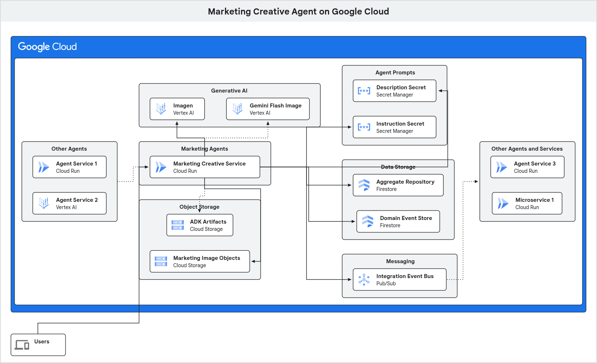

# Hexagonal ADK AI Agent

This project is a starting point for building AI agents using the Agent Development Kit (ADK) and a hexagonal architecture.  It provides a basic agent that can be extended and adapted to your own needs.

-------------------------------------------------------------------------------------------------------------

## Beyond Probabilistic Agents: The Need for a Deterministic Core

AI agents, with their probabilistic nature and conversational memory, are incredibly powerful.  However, when applied to real-world business processes, they have inherent limitations.  Their fluid, conversational state is not a substitute for a robust, transactional, and auditable system of record.  Relying on an agent's memory alone for critical business operations is like building a bank on conversational history instead of a ledger.

The architecture in directory [2](/2/) is designed to solve this by wrapping the probabilistic agent in a deterministic, stateful, and auditable hexagonal system.  The agent can suggest actions, but the core system enforces the rules.  This separation unblocks the following critical requirements for production-class, real-world business settings:

| Principle | The Challenge | Why AI Agents Can Fall Short | The End-State Solution |
| :--- | :--- | :--- | :--- |
| **Reliable Asynchronous Operations** | Non-AI systems need a reliable way to react to the outcomes of an agent's work. A conversational history is not a dependable ontract. | An agent's state is internal and its outputs are probabilistic. There's no built-in mechanism for other systems to reliably subscribe to events or state changes. | The end-state agent emits **events** for every significant action - e.g. `MarketingImageGenerated`. These events are published for consumption, allowing any number of other systems to consume them reliably and asynchronously, without ever needing to interact directly with the agent. |
| **Granular Access Control** | Business systems require adherence to the principle of least privilege. | Agents often operate with broad permissions to access their tools. It's difficult to enforce context-specific access control based on a fluid conversational state. | The agent doesn't *perform* actions; it *requests* them by issuing **commands**. The system's core logic, through command handlers and domain aggregates, validates these requests against a protected, canonical state and the user's permissions before execution. |
| **Modular and Maintainable Design** | Systems must be flexible and easy to maintain. | Agents can become monolithic, with a single massive prompt and a complex set of tools, making them difficult to manage and update. | The hexagonal architecture promotes a clean separation of concerns. The system is built from individual, focused components (command handlers, event handlers, etc.) that are easy to build, test, and maintain independently. |
| **Guaranteed Business Rule Enforcement** | Business rules and invariants must be non-negotiable. | An agent can be persuaded to ignore previous instructions. Its memory is for context, not for enforcing the immutable laws of your business. | Business logic is encapsulated within **domain aggregates**, which protect the canonical state. The only way to modify the state is by calling methods on the aggregate, which guarantees that all business rules are enforced, always. |
| **Testability and Determinism** | The core logic of a business system must be testable and predictable. | It is notoriously difficult to write unit tests for probabilistic systems. You can't guarantee the same input will produce the same output. | The state machine logic within the domain is pure, deterministic code. It can be thoroughly unit-tested without ever making a call to a large language model. The probabilistic AI is just one of many adapters at the edge of the system and can be easily mocked. |
| **Explicit and Auditable Transaction Logs** | Businesses need an immutable, auditable log of all transactions, not just a conversational history. | An agent's memory is designed for conversational context, not as a secure, replayable log of state changes. | The system uses **event sourcing**. Every single change to the state is captured as an immutable domain event and stored in an event store. This sequence of events *is* the transaction log—an explicit, auditable, and replayable history of the system. |
| **Safe and Isolated Logic Updates** | You need to be able to update one part of the system without the risk of breaking another. | Modifying an agent's prompt to improve one behaviour can have unintended and unpredictable consequences on its other capabilities. | The decoupled nature of the hexagonal architecture means that business logic is isolated. You can change a business rule inside a domain aggregate with confidence that you will not break the AI adapter or the database adapter. |
| **Measurable Business Milestones** | Business processes need to be monitored and measured against concrete milestones. | A conversation is a continuous stream of text and does not naturally lend itself to tracking discrete business outcomes. | The **domain events** represent concrete, measurable business milestones - e.g. `MarketingImageGenerated`, `MarketingImageAccepted`, `MarketingImageRejected`. These events can be easily counted, monitored, and fed into business intelligence tools. |
| **Business-Critical Controls and Exception Handling** | High-risk operations and exceptions must be handled through clear, auditable workflows. | Leaving exception handling to a probabilistic agent is risky. It may not follow the correct escalation path or may "hallucinate" an inappropriate solution. | The system uses deterministic logic to handle high-risk operations. For example, a command handler can enforce a rule that requires a specific user role for approval, with the entire workflow being captured in the event log for auditing. |
| **Human-in-the-Loop Gating** | Probabilistic processes cannot be allowed to unilaterally approve high-value or high-importance transactions. | An agent could be tricked or could simply make an error, leading to the approval of a transaction without proper oversight. | The agent can only *initiate* a transaction by issuing a command. A command handler can then check the transaction's value and, if it exceeds a certain threshold, place the domain aggregate into a `PendingApproval` state, ensuring that no further action is taken until a human provides explicit approval. |
| **Persistent "Safe States" for Paused Processes** | Long-running workflows need to be able to pause and safely await external input - e.g. from a user or another system - before resuming. | An agent's memory is not designed to be a persistent, "safe state" that can survive a system restart or wait for days for an external trigger. | The state of the domain aggregate is persisted. A process can be in a `WaitingForExternalInput` state indefinitely. When the required input arrives, another command is dispatched to the aggregate, which then validates the input and transitions to the next state in the workflow. |

-----------------------------------------------------------------------------------------------------------

## End-State Benefits
| Quality Attribute | Description |
| :--- | :--- |
| **Maintainability** | Clear separation of concerns makes the codebase easier to understand, debug, and modify. |
| **Modifiability** | Rapid and safe introduction of new features or changes due to the isolated nature of components. |
| **Modularity** | The modular design allows for independent development and deployment of components, fostering better organisation and management of the codebase. |
| **Observability** | Both the business state and logic (deterministic) and the agent's internal state and behaviour (probabilistic) are transparent, making it easier to monitor and troubleshoot. |
| **Portability** | The agent can be easily moved to different environments or cloud providers due to its decoupled architecture. |
| **Testability** | Isolated components can be tested independently, leading to more robust and reliable agents. |
| **Flexibility** | Business logic is decoupled from probablistic elements and external dependencies, making it easier to swap out infrastructure components - e.g. databases, AI models, etc. - without affecting the core functionality. |
| **Auditability** | The clear separation of concerns and well-defined interfaces make it easier to implement logging, monitoring, and auditing mechanisms, providing a transparent view of the agent's operations and decisions. |
| **Securability** | Enhanced security measures can be implemented at each layer, protecting sensitive data and intellectual property. |
| **Scalability** | The architecture supports easy integration of new technologies and services, allowing the agent to grow and adapt. |
| **Performance** | Optimised resource utilsation and faster response times due to efficient component interaction and data flow. |
| **Measurability** | The architecture facilitates the collection of metrics and data points, allowing for quantitative analysis of the agent's performance, efficiency, and impact. |
| **Configurability** | The agent's behaviour can be easily modified through external configurations without changing the code. |
| **Extensibility** | The ability to add new features or modify existing ones with minimal impact on the rest of the system. |
| **Composability** | The ability to combine and recombine smaller, independent components to create new functionalities or agents. |
| **Learnability** | The architecture is designed to be easily understood and adopted by new team members, reducing the learning curve and accelerating onboarding. |
| **Localisability** | The ability to adapt the agent to different languages, regions, and cultural contexts, ensuring a broader reach and user acceptance. |
| **Team Collaboration** | Different teams can work on different layers or adapters simultaneously with minimal conflicts. |

-----------------------------------------------------------------------------------------------------------

## Getting Started

### Main Prerequisites

* Python 3.12
* uv
* pip
* Virtualenv (recommended)

### Installation

1.  **Clone the repository:**
    ```bash
    git clone https://github.com/rbannist/hexagonal-adk-ai-agent.git
    ```

2.  **Create and activate a virtual environment for each of the steps/the step you're working on:**
    ```bash
    cd <directory - e.g. hexagonal-adk-ai-agent/0>
    uv venv
    source .venv/bin/activate
    ```

3.  **Set up your environment variables for the agent service to use:**
    Create a `.env` file by copying the example file:
    ```bash
    cp .env.example .env
    ```
    Now, edit the `.env` file and add your configuration details.

3.  **Follow the instructions in the given agent's directory/README.md:**
    - Step 0 Agent
        - [Readme](https://github.com/rbannist/hexagonal-adk-ai-agent/blob/main/0/README.md)
    - Step 1 Agent
        - [Readme](https://github.com/rbannist/hexagonal-adk-ai-agent/blob/main/1/README.md)
    - Step 2 Agent
        - [Readme](https://github.com/rbannist/hexagonal-adk-ai-agent/blob/main/2/README.md)

-----------------------------------------------------------------------------------------------------------

### Google Cloud Deployment End State



-----------------------------------------------------------------------------------------------------------

## Roadmap / Future Intentions

| Step | What's Being Introduced | Why It's Valuable |
| :--- | :--- | :--- |
| **3** | **Foundational Infrastructure & Governance** | This step prepares the agent for scalable, repeatable deployments and formalises our architectural principles. |
| | <ul> <li>Terraform Google Cloud resource deployment.</li> <li>Documented Quality Attributes & ADRs fed into code and deployment concerns.</li> </ul> | <ul> <li>**Terraform IaC** allows us to automatically and reliably deploy the cloud infrastructure - e.g. storage for images, container runtime, etc. -  needed to run our agent. </li> <li>**ADRs** and defined **Quality Attributes** - e.g. performance, security, reliability, observability, etc. - force us to make conscious decisions, ensuring the architecture can handle what's required of it.</li> </ul> |
| **4** | **Production-Grade Observability** | We can't fix or improve what we can't see.  This step gives us deep insight into how image generation requests are performing. |
| | <ul> <li>Structured Logging.</li> <li>End-to-End Tracing (ADK + Traditional).</li> </ul> | <ul> <li>**Tracing** lets us follow a single request from the initial prompt to the final output, pinpointing bottlenecks or errors in the process. </li> <li>**Structured Logs** provide the rich, machine-readable details at each step of the trace, answering *why* a problem occurred.</li> </ul> |
| **5** | **Core Agent Performance & Statefulness** | This focuses on making the single agent faster, smarter, and more capable of handling complex, long-running tasks. |
| | <ul> <li>Async end-to-end processing.</li> <li>Vertex AI Agent Engine (Memory & Sessions).</li> <li>ADK Artifact Storage advancements.</li> </ul> | <ul> <li>**Async processing** makes the whole agent service non-blocking, so it can start generating a complex image while remaining responsive to other users.</li> <li>**Memory & Sessions** allow the agent to remember context from a user's previous requests - e.g. "Use the same colour palette as last time", leading to more coherent and useful images. </li> <li>Advanced **Artifact Storage** improves how we manage the terabytes of generated images, drafts, and assets.</li> </ul> |
| **6** | **Advanced Multi-Agent System Architecture** | This evolves our single agent into a sophisticated system of collaborating specialist agents, enabling complex, automated marketing workflows. |
| | <ul> <li>An **Agent / A2A Registry**.</li> <li>Multi-agent patterns - i.e. CQRS, Sagas, Event Sourcing, Claim-Check, etc. </li> </ul> | <ul> <li>We can now have specialised agents. The **Registry** allows them to discover and talk to each other.</li> <li>Patterns like **Choreography Sagas** and **Event Sourcing** enable reliable, multi-step workflows - e.g. draft image -> get legal approval -> publish to social media - without a central point of failure. The **Claim-Check** pattern is used to pass large data, like high-resolution images, between them efficiently.</li> </ul> |